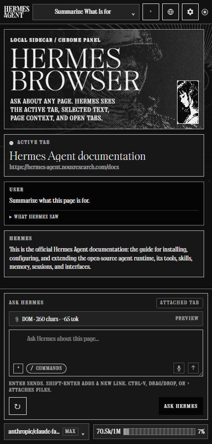
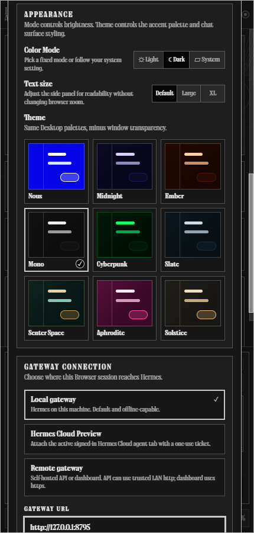
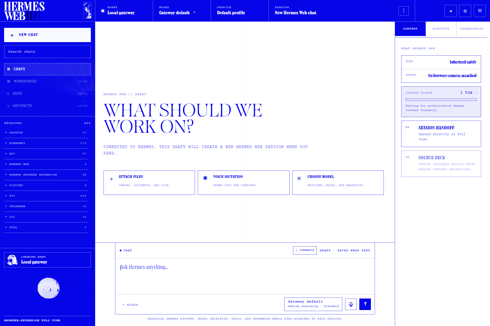
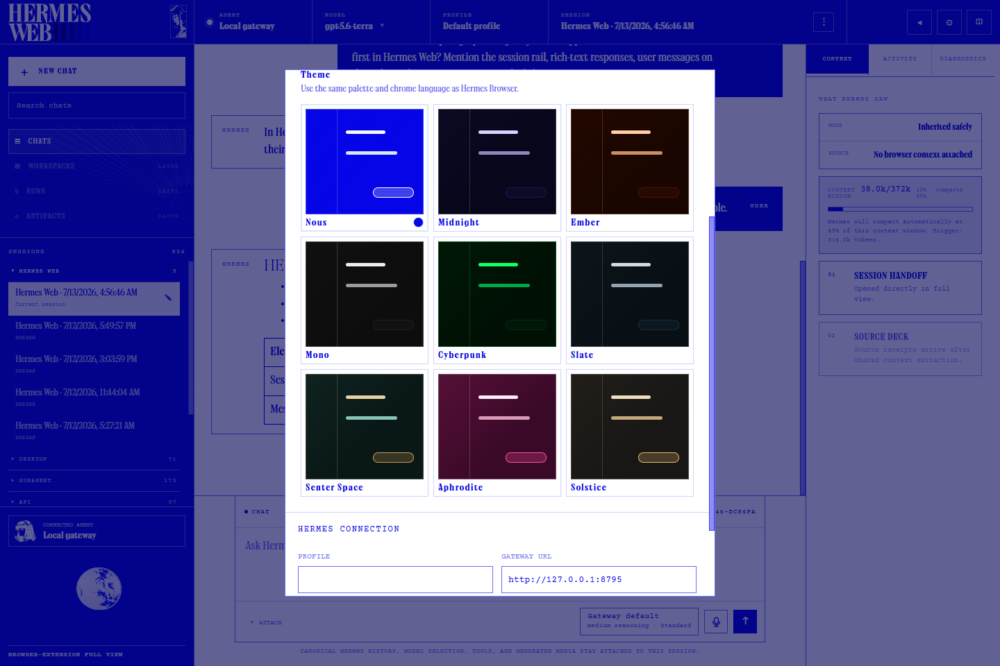
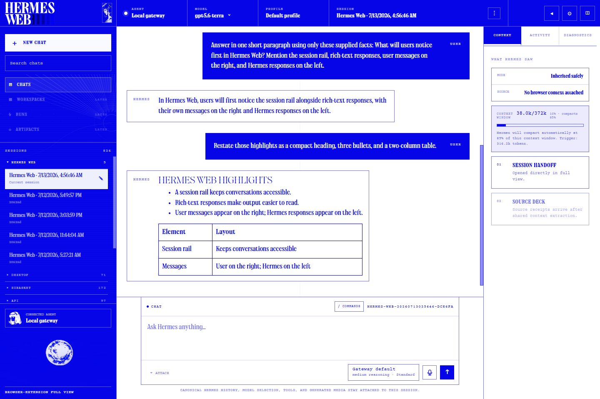

# Hermes Browser Extension

Browser-native side panel for [Hermes Agent](https://hermes-agent.nousresearch.com/docs) — connect active web context through a local gateway, Hermes Cloud, or a self-hosted remote gateway.

> Created by **Jon Komet** (`@abundantbeing`). Community extension for Hermes Agent by Nous Research.

<p align="center">
  
</p>

<p align="center">
  <strong>Public alpha v0.1.11 · Load unpacked · Local / Hermes Cloud / Remote · Full Hermes runtime tools</strong><br />
  Not on the Chrome Web Store yet.
</p>

## What it is

Hermes Browser Extension is not a browser chatbot. It is a Chrome/Edge/Chromium side panel for the real Hermes Agent runtime. Choose a local gateway, attach to a signed-in Hermes Cloud agent tab, or connect to a self-hosted remote API/dashboard. Local and remote API connections can use the models, tools, skills, sessions, memory, and MCP servers already configured in Hermes; Cloud and dashboard-ticket connections are intentionally Chat-only.

This repo is specifically for the **Hermes Browser Extension**: the Chrome/Edge/Chromium side-panel integration for Hermes Agent.

## Visual tour

| Side panel | Theme settings | Local agents |
| --- | --- | --- |
|  |  |  |
| Browser behavior | Page-only context | Hermes compatibility |
|  |  |  |

### Hermes Web

Open the extension's full view for canonical Hermes sessions, model/runtime control, rich messages, generated media, and accurate session context telemetry in a browser-native workspace.

Hermes Web Alpha currently uses token-backed **Local or Remote API** connections. Hermes Cloud Preview and ticketed remote-dashboard transports remain Chat-only in the side panel; live full-view dashboard handoff is not shipped yet.

<p align="center">
  
</p>

<p align="center"><strong>Start a fresh canonical Hermes Web session</strong></p>

<p align="center">
  
</p>

<p align="center"><strong>Choose from nine themes with Light and Dark modes</strong></p>

<p align="center">
  
</p>

<p align="center"><strong>Read rich Hermes responses while canonical history stays attached</strong></p>

## Highlights

- Adds **Hermes Web Alpha**, a full-page browser workspace for canonical Hermes sessions with a session rail, user-right/Hermes-left messages, safe rich Markdown, model/runtime controls, tools, skills, attachments, voice, active-run steering, generated media, and a context/activity/diagnostics inspector.
- Chrome/Edge/Chromium MV3 side panel powered by the Side Panel API.
- Matches Hermes Desktop's three connection choices: **Local gateway**, **Hermes Cloud**, and **Remote gateway**.
- Connects to a configurable local or self-hosted remote Hermes API server. Default: `http://127.0.0.1:8642`.
- Uses **Trusted Dashboard Attach** for Hermes Cloud: an explicitly selected, signed-in HTTPS agent tab mints a short-lived, single-use WebSocket ticket. Tickets stay memory-only and Cloud remains Chat-only.
- Supports the same ticketed WebSocket path for a self-hosted remote dashboard when Remote gateway is selected with no API key.
- Auto-syncs connected Hermes providers/models, profiles, skills, sessions, and capabilities.
- Keeps runtime plugins available in the same Hermes session. For example, a connected social or messaging plugin can add account, post, and trend context while the extension supplies browser-page context.
- Shows a Hermes compatibility panel so older gateways degrade into explicit fallback/manual modes instead of broken route errors.
- Adds **Copy Diagnostics** for v0.1.11 support reports: browser family, version/build, extension origin, gateway origin, capability flags, context mode, selected model/provider, and last visible error with tokens/page content stripped.
- Adds an optional **Hermes Browser Companion Plugin** that passively caches sanitized Browser Context Protocol metadata for Hermes tools/hooks without browser control, network calls, or API-server routes.
- Adds `/meta` / `/metadata` / `/head` for truthful captured-page metadata analysis: it reports only what the Browser context actually contains and explicitly calls out metadata classes that were not captured.
- Adds session controls for Browser work: create/switch sessions, copy session IDs, rename sessions, smart first-message titles, and compact on-brand session actions.
- Adds Browser-scoped model control: Browser model choices and per-session bindings stay inside the extension and do not mutate Hermes global defaults.
- Sends active tab/browser context into a persisted Hermes session, or switches to Chat only when you do not want browser context attached.
- Adds a composer-header context menu for Chat only, following the active tab, pinning a specific tab, and choosing which open tabs appear in the prompt.
- Opens as a tab-attached side panel by default, with a setting to keep the panel global across tabs.
- Opens with a keyboard shortcut (`Alt+H` by default, customizable at `chrome://extensions/shortcuts`).
- Keeps pinned-tab conversations isolated with per-tab local history and Hermes session bindings.
- Adds quick commands for common browser-context work, including `/summarize`, `/explain`, `/rewrite`, `/tabs`, and `/action-items`.
- Adds a collapsible “What Hermes saw” receipt after each sent turn for transparent context/debugging.
- Shows a live Tool Activity Strip while Hermes streams, so tool calls appear as structured runtime activity instead of raw `[tool]` markdown appended into answers.
- Classifies upstream Hermes runtime/tool exceptions as connected-with-warning diagnostics when the gateway is reachable, including the known Python `NoneType`/`int()` traceback class.
- Captures active tab title/URL, open tabs, selected text, readable page text, metadata, headings, forms, links, and buttons where available.
- Supports voice dictation through Hermes audio transcription when available, with Browser speech fallback when the connected runtime does not expose STT.
- Wraps webpage text as untrusted context before sending it to Hermes.
- Streams Hermes responses and falls back to non-streaming chat when needed.
- Includes Desktop-style appearance settings with Light/Dark/System mode and nine themes: Nous, Midnight, Ember, Mono, Cyberpunk, Slate, Senter Space, Aphrodite, and Solstice.
- Adds generated-image reveal animation plus a lightbox with zoom, reset, open, and explicit download controls.
- Omits credential-bearing tab URLs from prompt-facing context, including decoded/nested query or hash parameters and common signed-URL credentials/signatures.
- Includes a localhost agent picker for switching between trusted local Hermes API gateway ports.
- No `debugger`, `nativeMessaging`, click/type/form-submit, cookies, history, bookmarks, or browser-control permissions in v0.1. The `downloads` permission is used only when the user explicitly saves generated images or artifacts.

## Requirements

- Hermes Agent installed and working.
- For Local or Remote API mode: Hermes Gateway/API server enabled locally or on a reachable remote machine. Hermes Cloud instead requires a signed-in HTTPS agent tab.
- Node.js 20+.
- Chrome, Edge, Brave, Comet, or another Chromium browser with Side Panel API support (Chrome 114+ baseline). Firefox is available as a preview package through `npm run build:firefox`.

## v0.1.11 compatibility matrix

| Surface | Supported in v0.1.11 | Fallback / note |
| --- | --- | --- |
| Chrome / Edge / Chromium 114+ side panel | Yes | Primary public support target. |
| Brave / Comet / Chromium forks | Best-effort | Must expose the Chromium Side Panel API and extension clipboard permissions for Copy Diagnostics. |
| Firefox | Preview package | `npm run build:firefox` produces `dist/firefox/` with Firefox-specific manifest adaptation. Chrome/Edge/Chromium remain the primary public support target. |
| Safari | Not shipped | Browser-family diagnostics exist, but no Safari package is included. |
| Local Hermes API server | Yes | Default path: `http://127.0.0.1:8642`. |
| Hermes Cloud | Yes, Trusted Dashboard Attach | Requires an active signed-in HTTPS Hermes Cloud agent tab. Uses a single-use WebSocket ticket and enforces Chat-only context. This is not a general cookie import or background account-discovery flow. |
| Remote API server | Yes, explicit URL/token only | Use trusted LAN/Tailscale/VPN or HTTPS reverse proxy; do not expose Hermes naked to the internet. |
| Self-hosted remote dashboard WebSocket | Best-effort | Select Remote gateway with an HTTPS dashboard URL and no API key. Chat/session/model path only; REST-only profile/skills/image-upload surfaces remain unavailable. |
| Hermes Web full view | Local/Remote API alpha | Requires a token-backed Local or Remote API connection. Cloud Preview and ticketed remote-dashboard transports remain Chat-only in the side panel. |
| Browser Context Protocol | Yes | Extension emits `hermes.browser.context.v1` payloads and keeps prompt-embedded fallback. |
| Companion plugin | Optional functional context cache | `companion-plugin/` provides read-only tools/hooks for sanitized Browser context; not required for normal extension use. |
| Browser control / Runs UI / debugger / nativeMessaging | No | Deferred until supportability, action policy, approvals, and logs exist. |

## Quick start

### 1. Clone and build

```bash
git clone https://github.com/abundantbeing/hermes-browser-extension.git
cd hermes-browser-extension
npm install
npm run build
```

The loadable extension is generated at:

```text
dist/
```

### 2. Load unpacked in Chrome/Edge

1. Open `chrome://extensions` or `edge://extensions`.
2. Enable **Developer mode**.
3. Click **Load unpacked**.
4. Select this repo's `dist/` folder — not the repo root and not `extension/`.
5. Pin/click the Hermes extension icon to open the side panel.

After code updates, run `npm run build` again and click **Reload** on the Hermes Browser Extension card in the browser extensions page.

## Connect to Hermes

Settings exposes the same three product-level choices as Hermes Desktop:

| Connection mode | Use it for | Transport and boundary |
| --- | --- | --- |
| **Local gateway** | Hermes running on this machine | Local API server, default `http://127.0.0.1:8642`, with a scoped browser token or `API_SERVER_KEY`. |
| **Hermes Cloud** | A signed-in Hermes Cloud agent open in a normal browser tab | Trusted Dashboard Attach mints a short-lived, single-use WebSocket ticket from the active HTTPS agent tab. Chat-only; no page text, selected text, open-tab context, or attachments are sent. |
| **Remote gateway** | A self-hosted Hermes backend on another machine or behind a trusted proxy | With a key: remote API server. Without a key: signed-in HTTPS dashboard ticket/WebSocket. |

Existing installations migrate automatically: prior `local-api` settings become Local gateway, while prior `remote-api` and `remote-dashboard` settings remain Remote gateway. A legacy remote dashboard is never silently relabeled as Hermes Cloud.

### Local API server

Local-only is the safest default. Put this in `~/.hermes/.env` on the machine running Hermes:

```bash
API_SERVER_ENABLED=true
API_SERVER_HOST=127.0.0.1
API_SERVER_PORT=8642
API_SERVER_KEY=<your-api-server-key>
API_SERVER_CORS_ORIGINS=chrome-extension://<your-extension-id>
```

Start or restart the gateway:

```bash
hermes gateway run
```

Verify the API server:

```bash
HERMES_GATEWAY_URL=http://127.0.0.1:8642
HERMES_API_TOKEN='<your-api-server-key-or-browser-token>'
curl "$HERMES_GATEWAY_URL/health"
curl -H "Authorization: Bearer $HERMES_API_TOKEN" "$HERMES_GATEWAY_URL/v1/models"
```

Then in the extension side panel:

1. Click **Connect to Hermes** and approve locally if your Hermes Desktop/gateway supports the approval flow.
2. If approval is not available yet, click **Manual setup**.
3. Choose **Local gateway**.
4. Use Gateway URL `http://127.0.0.1:8642`.
5. Paste your scoped browser token or `API_SERVER_KEY`.
6. Click **Test connection**, then **Save settings**.
7. Open a normal `https://` page and ask: `Summarize this page in one sentence.`

### Remote API server

For a remote Hermes machine, bind the API server to a reachable trusted interface and keep CORS narrow:

```bash
API_SERVER_ENABLED=true
API_SERVER_HOST=0.0.0.0
API_SERVER_PORT=8642
API_SERVER_KEY=<your-api-server-key>
API_SERVER_CORS_ORIGINS=chrome-extension://<your-extension-id>
```

Use a private same-LAN/Tailscale/VPN host with HTTP, or put the API server behind a trusted HTTPS reverse proxy for public/proxied access. Do **not** expose the Hermes API server naked to the public internet. The Hermes API server can access the real Hermes runtime and tools.

Examples:

```text
http://192.168.1.50:8642
http://hermes-desktop.local:8642
https://hermes.example.com
```

In the extension side panel:

1. Choose **Remote gateway**.
2. Paste the remote API URL, including `http://` or `https://`.
3. Paste the API key/browser token.
4. Click **Test connection**.

With a key present, Remote means **Remote API server** and does not force HTTPS. With the key blank, Remote means **Remote dashboard WebSocket** and requires an `https://` dashboard URL.

### Hermes Cloud Preview

Hermes Cloud Preview uses **Trusted Dashboard Attach**:

1. Open your Hermes Cloud agent in a normal browser tab and sign in.
2. Keep that fully loaded HTTPS agent tab active.
3. Open extension Settings and choose **Hermes Cloud Preview**.
4. Click **Connect to Hermes** or **Test connection**.

The extension binds trust to that exact active tab and HTTPS origin, verifies the tab again before minting, mints a short-lived single-use WebSocket ticket in the page, and verifies the WebSocket handshake before reporting success. The ticket is kept in memory only and is never persisted or logged. Cloud never falls back to localhost or a stored Local API token.

Hermes Cloud is **Chat-only** in this release. Browser page text, selected text, open-tab context, and attachments are disabled for this mode. The extension does not read dashboard cookies, store a Cloud password, or add `cookies` or `nativeMessaging` permissions.

If the connected Cloud agent does not expose `/api/auth/ws-ticket`, `/api/ws`, or the required session/model RPC methods, the extension reports the missing capability and leaves Local/Remote settings untouched. Update that agent's Hermes runtime using the [official Hermes Agent installation and update docs](https://hermes-agent.nousresearch.com/docs/getting-started/installation). It never redirects Cloud to `127.0.0.1` as a fallback.

### Self-hosted remote dashboard mode, no API server

If you run Hermes elsewhere and only expose the OAuth-gated dashboard, select **Remote gateway**, enter the dashboard's `https://` URL, and leave the API key blank. With no key, the extension connects over the dashboard's `/api/ws` socket instead of the REST API server. This remains a Remote gateway connection; it is not automatically relabeled as Hermes Cloud.

Auth uses a single-use WebSocket ticket minted from a signed-in dashboard tab:

- Open the dashboard URL in a normal browser tab and sign in, and keep that tab around.
- The extension mints the ticket first-party from that tab, then opens the socket.
- **Test connection** opens the socket, loads models, and reads the dashboard profile list when supported.
- Choose a profile in Settings to request a new Browser session scoped to that profile. The selection is reverified before creation, and no API key is stored for this mode.

The extension reads `/api/profiles` first-party inside the signed-in dashboard tab, just as it mints the WebSocket ticket there. Profile-scoped sessions additionally require the dashboard to advertise `session_profiles` on the `gateway.ready` event: without it, the extension refuses to send a profile-scoped `session.create`/`session.resume` at all, so a legacy dashboard never creates a stray launch-profile session. On supporting dashboards, an explicit selection still blocks if the profile disappears or the response does not echo the same effective profile back (the ack that rules out a silent launch-profile fallback when a profile is deleted between discovery and the request). Choose **Detect from Hermes gateway** for the launch-profile fallback on dashboards without that support; the Settings status line says when profiles can be listed but profile-scoped sessions are unsupported. Sessions are tracked by their durable stored id (`stored_session_id`), while the per-socket live id is used for history, prompt, steer, and interrupt calls; local profile bindings key off the stored id because current dashboards list only launch-profile sessions. Image attachments remain inline-only, and skills stay unavailable because those routes are not bridged in dashboard mode.

## What syncs after connection

After a Local or Remote API connection, the side panel loads from the connected Hermes gateway:

- `/v1/models` — all providers/models Hermes can enumerate, including provider-qualified IDs.
- `/api/sessions` — recent Hermes sessions grouped by source.
- `/v1/skills` — slash-command skill suggestions in the composer.
- `/v1/profiles` — profile picker when the gateway exposes profile metadata.
- `/api/profiles` — profile picker in signed-in remote dashboard mode; verified selections are passed to new WebSocket sessions.
- `/v1/capabilities` — feature flags such as audio transcription and Browser upload support.

The DOM/context chip should show a non-zero page-context count on normal readable pages. Browser internal pages such as `chrome://extensions` are intentionally restricted.

### Context window and compaction

Context compression remains owned by Hermes Agent, using each runtime's effective `context_length` and configured compression threshold. The Browser and Web surfaces display the authoritative persisted/live fields when available: `last_prompt_tokens`, `threshold_tokens`, `context_length`, `usage_percent`, and `compression_count`.

- The extension does not hardcode an 85% threshold; it honors the connected user's/runtime's value.
- Reaching the threshold is shown as **Compaction due on the next Hermes turn**. Hermes performs its normal pre-model-call compression and the client refreshes telemetry afterward.
- Legacy sessions already beyond a model limit are labeled honestly and allowed to recover through Hermes' pre-turn compressor.
- Older gateways without runtime telemetry use a clearly labeled local estimate. The client never treats cumulative lifetime token spend as live prompt context and never truncates/summarizes canonical history itself.

## Install with Hermes / Computer Use

You can ask Hermes to help install it:

```text
Install Hermes Browser Extension from https://github.com/abundantbeing/hermes-browser-extension. Clone it, run npm install, run npm run build, then use computer use to open chrome://extensions, enable Developer mode, and load the dist folder unpacked. Help me choose Local gateway, Hermes Cloud through my active signed-in agent tab, or a self-hosted Remote gateway. Do not reveal, print, screenshot, or commit any API key or WebSocket ticket.
```

## Security model

Hermes Browser Extension is intentionally conservative in v0.1:

- Local gateway by default; remote API server support requires an explicit URL, token, and CORS allowlist.
- Hermes Cloud and self-hosted dashboard attach require an explicit HTTPS origin, the exact active signed-in tab, and a short-lived single-use WebSocket ticket kept only in memory.
- Cloud/dashboard-ticket connections are Chat-only and cannot send browser page text, selected text, open-tab context, or attachments.
- Strong bearer/API key required for API access.
- Page content is wrapped as untrusted context before it reaches Hermes.
- Credential-bearing URLs are omitted from active, selected, open-tab, pinned-scope, prompt, receipt, and payload-hash surfaces.
- Read-only browser context capture: no click, type, form-submit, checkout, download, or browser-control behavior.
- No `debugger`, `nativeMessaging`, `cookies`, `history`, or `bookmarks` permissions. `downloads` is limited to explicit user-requested generated-image/artifact saves.
- Restricted pages include browser internals, extension pages, and obvious banking/crypto/password/payment/health/government-tax categories.

See [`SECURITY.md`](SECURITY.md), [`PERMISSIONS.md`](PERMISSIONS.md), [`DATA-FLOW.md`](DATA-FLOW.md), and [`PRIVACY.md`](PRIVACY.md) for details.

## Troubleshooting

### I loaded the extension but nothing works

Make sure you loaded `dist/`, not the repo root. The selected folder must contain `manifest.json` directly.

### Chrome still shows an older version after updating

The browser is still using an old unpacked folder or an unpacked extension card that was not reloaded. For v0.1.11, the source manifest, built `dist/` manifest, and release archive should all contain `manifest.json` version `0.1.11`.

Fix:

1. Extract/download the v0.1.11 release or run `npm run build` locally.
2. Open `chrome://extensions` or `edge://extensions`.
3. On the Hermes Browser Extension card, click **Reload**.
4. If it still shows an older version, click **Remove**, then **Load unpacked** again and select the fresh v0.1.11 `dist/` folder.
5. Click **service worker** / **Inspect views** only for debugging; it is not the version source.

### Filing a support issue

Open Settings → **Support diagnostics** → **Copy Diagnostics** and paste the report into the GitHub issue or support thread.

The copied block includes version/build, browser family, gateway origin, connection state, runtime capability flags, selected model/provider, context mode, extractor mode, and last visible error. It intentionally excludes API keys, bearer tokens, cookies, page text, selected text, tab titles, and full tab URLs.

### The side panel says it cannot connect

Check that Hermes Gateway/API server is running and reachable from the browser:

```bash
curl http://127.0.0.1:8642/health
# or, for remote mode:
curl http://<trusted-remote-host>:8642/health
```

If `/v1/models` fails, check `API_SERVER_KEY`, the extension's stored API key/browser token, and `API_SERVER_CORS_ORIGINS`. For remote mode, the browser extension origin (`chrome-extension://<id>`) must be allowlisted on the Hermes machine.

### The side panel shows a runtime warning but still says connected

v0.1.11 separates gateway reachability from upstream Hermes runtime/tool failures. If `/health` works but Hermes raises a runtime traceback, the Browser stays connected and shows the warning instead of turning the whole connection red.

For tracebacks like `int() argument must be a string, a bytes-like object or a real number, not 'NoneType'`, check the Hermes Agent logs on the machine running the gateway. If the traceback mentions `computer_use` or `cua-driver`, run:

```bash
hermes computer-use doctor
```

That diagnostic belongs to the Hermes runtime/tool layer, not to Browser extension packaging or Chrome permissions.

### Native Hermes computer use is not working

Hermes Browser Extension does not request browser-control permissions and does not drive pages itself. Native desktop control comes from Hermes Agent's `computer_use` toolset via `cua-driver`.

On the machine running Hermes, verify computer use directly:

```bash
hermes tools list
hermes computer-use status
hermes computer-use doctor
```

If `doctor` says the driver is missing:

```bash
hermes computer-use install
```

Then start a fresh Hermes session with the toolset enabled:

```bash
hermes -t computer_use chat
```

Common blockers from the Hermes docs:

- Windows over SSH runs in Session 0 and cannot see the interactive desktop; use the console/RDP session or the cua-driver Windows autostart pattern.
- Elevated/admin windows cannot be driven by a normal-integrity Hermes process on Windows.
- macOS needs Accessibility + Screen Recording permissions.
- Linux needs a reachable X11/Wayland display and AT-SPI.

### The DOM chip says `0 chars`

Open a normal `https://` page and refresh context. Browser internal pages (`chrome://`, `edge://`, extension pages, devtools, etc.) are restricted by design.

### Microphone says blocked or voice dictation does not start

Chromium side panels can suppress microphone permission prompts. Hermes Browser Extension handles this with capability-gated voice modes:

- **Hermes STT** when the connected Hermes runtime advertises audio transcription.
- **Browser speech fallback** when Hermes STT is unavailable and Chromium exposes Web Speech.
- A visible **Hermes Voice Dictation** tab when the side panel cannot capture the mic directly.

Suggested flow:

1. Click the mic button in the side panel.
2. If the side panel cannot capture the mic, a **Hermes Voice Dictation** tab opens.
3. In that tab, click **Start dictation**. This click is the permission gesture Chromium expects.
4. Speak, then click **Stop + transcribe** or **Stop speech** depending on the active mode.
5. The transcript is sent back to the side panel composer automatically.

If Chromium still says the mic is blocked, click **Open microphone settings** in the voice tab and set Microphone to **Allow** for `chrome-extension://<the Hermes extension id>/`, then return to the voice tab and try again.

### The first-run Connect flow is unavailable

Use **Manual setup** and choose Local gateway, Hermes Cloud, or Remote gateway. Local/Remote API connections use a Gateway URL and API key; Cloud and dashboard-ticket connections require the signed-in HTTPS dashboard tab. The native Desktop approval flow is still evolving during alpha.

## GitHub PR/Issue auto-review

This repo includes two Hermes review runners:

- `npm run review:watch` — local poller for open PRs/issues. This works now from a machine that can reach Hermes and is authenticated with `gh`.
- `npm run review:event` — GitHub-event runner for future GitHub Actions/webhook wiring. It expects `GITHUB_EVENT_NAME`, `GITHUB_EVENT_PATH`, and `GITHUB_REPOSITORY`.

The local poller checks open PRs and issues, computes a stable signature from PR head SHA or issue title/body, and only reviews changed targets. It upserts one bot comment per PR/issue with a stable marker. PR diffs and issue bodies are treated as untrusted input.

Local setup:

```bash
# Uses gh auth token, local API_SERVER_KEY from ~/.hermes/.env,
# and http://127.0.0.1:8642 by default.
npm run review:watch
```

Optional overrides:

```bash
HERMES_REVIEW_REPO=abundantbeing/hermes-browser-extension
HERMES_REVIEW_GATEWAY_URL=http://127.0.0.1:8642
HERMES_REVIEW_API_KEY=<api-server-key-or-scoped-token>
HERMES_REVIEW_MAX_TARGETS=3
HERMES_REVIEW_STATE_FILE=~/.hermes/hermes-browser-review-state.json
```

For a GitHub-hosted Actions runner later, `HERMES_REVIEW_GATEWAY_URL` must be reachable from GitHub. A runner cannot reach `http://127.0.0.1:8642` on your personal machine; use a remote Hermes API server behind Tailscale/VPN/HTTPS or a self-hosted GitHub runner on the same network. Pushing `.github/workflows/*` also requires a GitHub token with `workflow` scope.

Dry-runs:

```bash
npm run review:watch:dry-run

GITHUB_EVENT_NAME=pull_request_target \
GITHUB_EVENT_PATH=./event.json \
GITHUB_REPOSITORY=abundantbeing/hermes-browser-extension \
GITHUB_TOKEN=<github-token> \
npm run review:event:dry-run
```

## Development

```bash
npm test
npm run check:js
npm run check:manifest
npm run verify
npm run build
npm run package
```

Project layout:

```text
extension/
  manifest.json       MV3 extension manifest
  app.html            Hermes Web full-page workspace
  app.css             Hermes Web shell and conversation styling
  app.js              canonical sessions, models, tools, media, and full-view runtime
  background.js       side panel behavior
  content.js          page context collector
  sidepanel.html      side panel UI
  sidepanel.css       side panel styling
  sidepanel.js        Hermes API client + UI state
  voice-dictation.*   visible extension voice recorder fallback for blocked side-panel mic capture
  request-permissions.* visible extension mic-permission helper page
  sidepanel-preview.html static visual QA preview
  assets/             local Hermes fonts, icons, and imagery
  lib/browser-context-protocol.mjs versioned read-only browser context protocol helpers
  lib/runtime-events.mjs stable runtime/tool event names for Browser UI normalization
  lib/support-diagnostics.mjs redacted Copy Diagnostics support report helpers
  lib/connection-modes.mjs versioned Local / Cloud / Remote schema and compatibility migration
  lib/connection-controller.mjs generation-safe connection state controller
  lib/connection-dispatch.mjs maps Local / Cloud / Remote settings to the correct connect action
  lib/cloud-agent-tab.mjs trusted signed-in Cloud tab selection and validation
  lib/image-viewer.mjs generated-image lightbox state and zoom controls
  lib/common.mjs      shared prompt/context/security utilities
companion-plugin/     optional fail-soft Browser companion plugin with read-only context cache tools/hooks
scripts/
  build.mjs           copies extension/ to dist/
  build-firefox.mjs   produces the Firefox preview package at dist/firefox/
  check-manifest.mjs  validates required manifest assets/permissions
  hermes-review-github-event.mjs PR/issue event runner for GitHub Actions/webhooks
  hermes-review-watch.mjs local PR/issue review poller
  package.mjs         creates artifacts/hermes-browser-extension.tar.gz
tests/
  common.test.mjs     utility behavior tests
```

## Relationship to Hermes Agent

[Hermes Agent](https://github.com/NousResearch/hermes-agent) is an open-source project by Nous Research. Hermes Browser Extension is a community extension by Jon Komet that connects through a local gateway, Hermes Cloud agent tab, or self-hosted remote gateway. It is designed to live at the edge of the ecosystem without adding core tool-schema footprint.

Useful links:

- Hermes docs: <https://hermes-agent.nousresearch.com/docs>
- Hermes API server docs: <https://hermes-agent.nousresearch.com/docs/user-guide/features/api-server>
- Hermes upstream repo: <https://github.com/NousResearch/hermes-agent>

## Star History

<a href="https://www.star-history.com/?repos=abundantbeing%2Fhermes-browser-extension&type=timeline&legend=bottom-right">
 <picture>
   <source media="(prefers-color-scheme: dark)" srcset="https://api.star-history.com/chart?repos=abundantbeing%2Fhermes-browser-extension&type=timeline&theme=dark&legend=bottom-right&sealed_token=GF2Z0Dz8jAbfQ0SpqcdyUM458IUVYJKcy5MvICCmRG32E-UfAG6Ifb8GTV6LXCDIhyY0J5WPOLlIKbSrn1F9Me-7Zrpt3XoN-eFEkORrH9Kg6WT433Gtug" />
   <source media="(prefers-color-scheme: light)" srcset="https://api.star-history.com/chart?repos=abundantbeing%2Fhermes-browser-extension&type=timeline&legend=bottom-right&sealed_token=GF2Z0Dz8jAbfQ0SpqcdyUM458IUVYJKcy5MvICCmRG32E-UfAG6Ifb8GTV6LXCDIhyY0J5WPOLlIKbSrn1F9Me-7Zrpt3XoN-eFEkORrH9Kg6WT433Gtug" />
   
 </picture>
</a>

## Contributors

External contributions that have shipped are credited in [`CONTRIBUTORS.md`](CONTRIBUTORS.md).

## Author

Built by **Jon Komet** (`@abundantbeing`).

## License

MIT. See [`LICENSE`](LICENSE).
